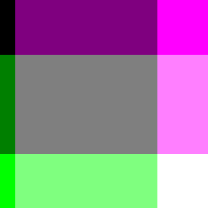

# Randomized Modern Art

 

## To create this masterpiece at home, all you have to do is:

* Have python3 and a virtual environment running on your computer.

* When in your virtual environment, type:

        pip install -r requirements.txt in your virtual environment.

* Make sure the files *create_art.py* and *random_art.py* are in the same directory as requirements.txt.

* At the $ prompt, type:

        python create_art.py -S 3561261957444303950

* Slack me if you like it!
